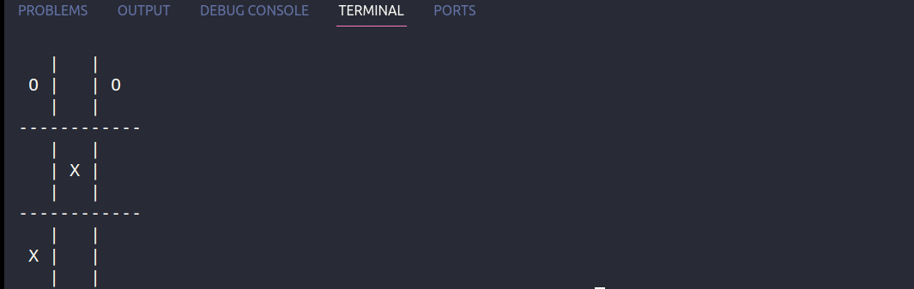
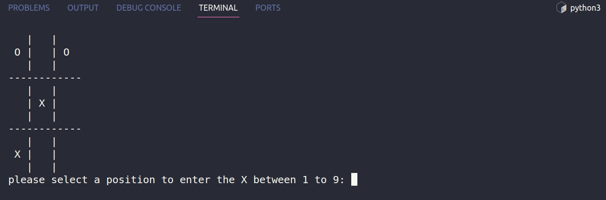

# TIC-TAC-TOE GAME


## Description
A simple game of tic tac toe, built in python.

## Languages or Frameworks Used
You only need Python to run this script. You can visit [here](https://www.python.org/downloads/) to download Python.

## How to run
Running the script is really simple! Just open a terminal in the folder where your script is located and run the following command:
```
python tic_tac_toe.py
```

## Demo

